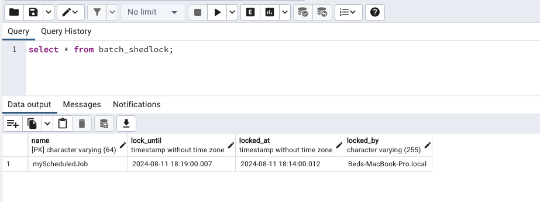

# i-learn-spring-batch-shedlock
i-learn-spring-batch-shedlock

```java
package com.bs.ilearn.spring.batch;

import net.javacrumbs.shedlock.spring.annotation.EnableSchedulerLock;
import org.apache.logging.log4j.LogManager;
import org.apache.logging.log4j.Logger;
import org.springframework.boot.SpringApplication;
import org.springframework.boot.autoconfigure.SpringBootApplication;
import org.springframework.scheduling.annotation.EnableScheduling;

/**************************************************************************************************************
 * Date: 08/11/2024 3:40 PM | Author: Singh, Bed |
 * To change this template, goto Settings or Preferences | Editor | File and Code Templates | Includes tab
 * Description: This is the main class to start the application.
 *
 **************************************************************************************************************/

@SpringBootApplication
@EnableScheduling
@EnableSchedulerLock(defaultLockAtMostFor = "PT30S")
public class ShedLockSpringBatchApplication {

	private static final Logger LOGGER = LogManager.getLogger(ShedLockSpringBatchApplication.class);
	private static final String DASH_LINE = "---------------------------------------------------------------------------";


	public static void main(String[] args) {
		final String startMsg = "******** ShedLock Spring Batch Application Starting, Please Wait...********";
		printLog(startMsg);

		SpringApplication.run(ShedLockSpringBatchApplication.class, args);

		final String successMsg = "********* ShedLock Spring Batch Application Started Successfully. *********";
		printLog(successMsg);
	}

	private static void printLog(String message) {
		LOGGER.info(DASH_LINE);
		LOGGER.info(message);
		LOGGER.info(DASH_LINE);
	}

}

```
```
SLF4J(I): Actual provider is of type [ch.qos.logback.classic.spi.LogbackServiceProvider@357246de]
18:10:35.228 [main] INFO com.bs.ilearn.spring.batch.ShedLockSpringBatchApplication -- ---------------------------------------------------------------------------
18:10:35.230 [main] INFO com.bs.ilearn.spring.batch.ShedLockSpringBatchApplication -- ******** ShedLock Spring Batch Application Starting, Please Wait...********
18:10:35.230 [main] INFO com.bs.ilearn.spring.batch.ShedLockSpringBatchApplication -- ---------------------------------------------------------------------------
.... 
... 
2024-08-11T18:10:36.364-05:00  INFO 11685 --- [i-learn-spring-batch-shedlock] [           main] c.b.i.s.batch.config.ShedLockConfig      : Creating LockProvider using JdbcTemplateLockProvider
2024-08-11T18:10:36.371-05:00  INFO 11685 --- [i-learn-spring-batch-shedlock] [           main] c.b.i.s.batch.config.ShedLockConfig      : Created LockProvider using JdbcTemplateLockProvider: net.javacrumbs.shedlock.provider.jdbctemplate.JdbcTemplateLockProvider@510da778
2024-08-11T18:10:36.372-05:00  INFO 11685 --- [i-learn-spring-batch-shedlock] [           main] c.b.i.s.batch.config.ShedLockConfig      : Creating TaskScheduler using ThreadPoolTaskScheduler
2024-08-11T18:10:36.373-05:00  INFO 11685 --- [i-learn-spring-batch-shedlock] [           main] c.b.i.s.batch.config.ShedLockConfig      : Created TaskScheduler using ThreadPoolTaskScheduler, ThreadNamePrefix: task-scheduler-
2024-08-11T18:10:36.487-05:00  INFO 11685 --- [i-learn-spring-batch-shedlock] [           main] c.b.i.s.b.ShedLockSpringBatchApplication : Started ShedLockSpringBatchApplication in 1.209 seconds (process running for 1.431)
2024-08-11T18:10:36.489-05:00  INFO 11685 --- [i-learn-spring-batch-shedlock] [           main] o.s.b.a.b.JobLauncherApplicationRunner   : Running default command line with: []
2024-08-11T18:10:36.489-05:00  INFO 11685 --- [i-learn-spring-batch-shedlock] [           main] c.b.i.s.b.ShedLockSpringBatchApplication : ---------------------------------------------------------------------------
2024-08-11T18:10:36.490-05:00  INFO 11685 --- [i-learn-spring-batch-shedlock] [           main] c.b.i.s.b.ShedLockSpringBatchApplication : ********* ShedLock Spring Batch Application Started Successfully. *********
2024-08-11T18:10:36.490-05:00  INFO 11685 --- [i-learn-spring-batch-shedlock] [           main] c.b.i.s.b.ShedLockSpringBatchApplication : ---------------------------------------------------------------------------
2024-08-11T18:11:00.043-05:00  INFO 11685 --- [i-learn-spring-batch-shedlock] [ask-scheduler-1] c.b.i.s.batch.service.MyScheduledJob     : BatchJob Started at time. : 2024-08-11T18:11:00.043722
2024-08-11T18:13:00.049-05:00  INFO 11685 --- [i-learn-spring-batch-shedlock] [ask-scheduler-1] c.b.i.s.batch.service.MyScheduledJob     : BatchJob Completed at time: 2024-08-11T18:13:00.049109
2024-08-11T18:14:00.016-05:00  INFO 11685 --- [i-learn-spring-batch-shedlock] [ask-scheduler-1] c.b.i.s.batch.service.MyScheduledJob     : BatchJob Started at time. : 2024-08-11T18:14:00.016095
2024-08-11T18:16:00.019-05:00  INFO 11685 --- [i-learn-spring-batch-shedlock] [ask-scheduler-1] c.b.i.s.batch.service.MyScheduledJob     : BatchJob Completed at time: 2024-08-11T18:16:00.019391
2024-08-11T18:17:00.020-05:00  INFO 11685 --- [i-learn-spring-batch-shedlock] [ask-scheduler-2] c.b.i.s.batch.service.MyScheduledJob     : BatchJob Started at time. : 2024-08-11T18:17:00.020584
2024-08-11T18:19:00.009-05:00  INFO 11685 --- [i-learn-spring-batch-shedlock] [ask-scheduler-2] c.b.i.s.batch.service.MyScheduledJob     : BatchJob Completed at time: 2024-08-11T18:19:00.009110

```

```sql
SQL Table:

CREATE TABLE IF NOT EXISTS batch_shedlock(
    name VARCHAR(64) NOT NULL,
    lock_until TIMESTAMP NOT NULL,
    locked_at TIMESTAMP NOT NULL,
    locked_by VARCHAR(255) NOT NULL,
    PRIMARY KEY (name)
);

```



<br/>  

```
Author Bed Singh
Date: 08/11/2024 18:20.667 

```  


